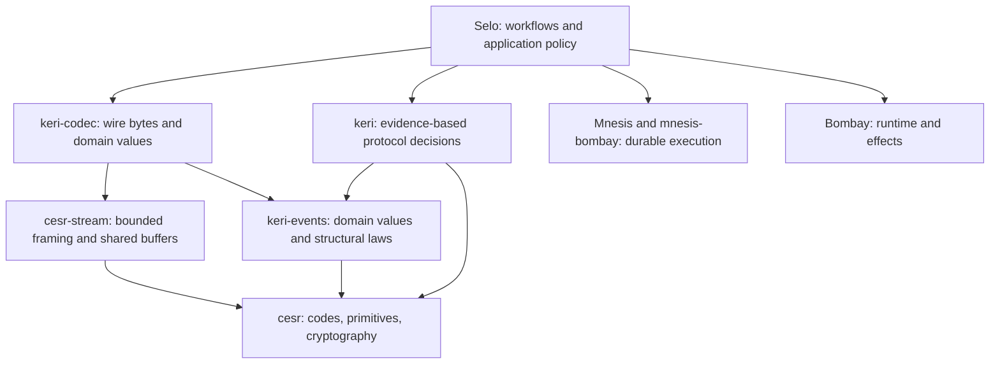

# CESR/KERI foundation audit — 2026-09-29

Baseline: `de08a972b390ea640519d4dcb7343d5dc4a864b9`.
Scope: all five crates' architecture and public boundaries; focused inspection of
parsing, authentication, transitions, registry semantics, ownership, allocation,
verification infrastructure, and suitability for Selo. The requested scope is the
full protocol foundation, before selecting a first-release profile.

**Implementation backlog and session restart instructions: [../TODO.md](../TODO.md).**
Executable observations: [2026-09-29-probes.rs](2026-09-29-probes.rs).
Recorded test and allocation output: [2026-09-29-results.txt](2026-09-29-results.txt).

## Assessment

The workspace has a useful Rust architecture worth preserving. Sealed code types,
role newtypes, exhaustive enums, typed errors, borrowed state, owned snapshots,
explicit evidence, and optional wire/runtime dependencies are substantial design
choices. This is not reasonably described as a wholesale Python translation.

It is not ready to serve as a trusted product foundation. Concrete authentication
defects pass the existing gate; message parsing has quadratic copying; TEL
acceptance differs materially from the reference protocol; and several advertised
capabilities have only vocabulary or codec support. The main weakness is that
invariants and ownership costs are lost between otherwise plausible layers.

Avoid a rewrite. Repair the acceptance rules and the buffer/ownership contracts,
then consolidate demonstrated duplication. More type parameters, fewer free
functions, and stricter lints do not establish correctness or speed by themselves.

This is an engineering audit with reproducible probes, not exhaustive protocol
certification, a cryptographic audit, or a production capacity benchmark. No
production behavior was changed during the audit. Sibling Bombay and
Mnesis–Bombay boundaries were inspected for integration context; those repositories
were not comprehensively audited. No comparison benchmark against another stack
was run, so there is no evidence for a fastest/best-in-class claim.

## Evidence and verification

- `nix flake check` passed for `aarch64-darwin` at the baseline. Results were
  already cached; incompatible systems were omitted. This does not establish a
  fresh run on Linux or every feature combination.
- The standalone audit probes exercise real Ed25519 signatures and the public
  message parser/fold. Nine observation tests passed. They intentionally assert
  the current defective behavior; future regression tests must assert rejection
  or the corrected behavior instead.
- The allocation probe also ran with `--release`. Allocation counters are thread
  local and count requested allocation/reallocation bytes, **not peak live heap**.
  Timing samples are illustrative single runs, not statistical benchmarks.
- Existing fuzz harnesses, property tests, allocation tests, differential corpora,
  and CI definitions were inspected. No extended fuzz campaign was run.

Reproduce from the repository root, first checking that the temporary destination
does not already exist:

```sh
test ! -e crates/keri-codec/tests/audit_probe.rs
cp docs/audits/2026-09-29-probes.rs crates/keri-codec/tests/audit_probe.rs
nix develop --command cargo test -p keri-codec --test audit_probe -- --nocapture
nix develop --command cargo test --release -p keri-codec --test audit_probe audit_attachment_copy_scaling -- --nocapture
rm crates/keri-codec/tests/audit_probe.rs
```

Run commands separately and stop if the initial existence check fails. The audit
used the already-active pinned Rust 1.95.0 environment for the focused Cargo runs.
The normal repository gate remains `nix flake check`.

## Confirmed acceptance and functionality defects

Priority here means repair order for the foundation, not a formal CVSS score.

### F01 — Critical: basic identifier is not bound to its controlling key

**Confirmed over the public wire path.** An inception with a victim's basic
nontransferable prefix, an attacker's unrelated verification key, and a valid
attacker signature is accepted by `EventMessage::parse` and `KeyState::incept`.
The resulting state associates the victim's identifier with the attacker key.

Owners: [`deserialize.rs`](../../crates/keri-codec/src/deserialize.rs),
`build_inception`; [`state.rs`](../../crates/keri/src/state.rs),
`validate_inception` / `decide_transferability`. Neither enforces the basic-prefix
key binding. Digest validity and a signature over declared keys are insufficient.

Probe: `audit_basic_identifier_accepts_an_unrelated_controlling_key`.
Check the whole inception law, including single-key/threshold restrictions,
nontransferable restrictions, and digestive prefixes for delegated events. The
pinned reference explicitly validates these relationships in
[SerderKERI](https://github.com/WebOfTrust/keripy/blob/de59bc7d834955c5b0273c62f6b8b6a0df150dc3/src/keri/core/serdering.py).

### F02 — High: a plain rotation bypasses delegated-rotation authorization

**Confirmed over the public wire path for the incoming rotation.** Once a
delegated state exists, `KeyState::ingest` accepts `KeriEvent::Rotation` using
the committed next keys, with no delegation evidence. The state remains marked
delegated. The probe establishes the initial dip through the explicit
`HostAccepted` path; the defect is the subsequent plain `rot` acceptance.

Owner: [`state.rs`](../../crates/keri/src/state.rs), `ingest` / `rotate`.
Probe: `audit_plain_rotation_bypasses_delegation_evidence`.
The reference rejects ordinary rotations on delegated state in
[Kever.update](https://github.com/WebOfTrust/keripy/blob/de59bc7d834955c5b0273c62f6b8b6a0df150dc3/src/keri/core/eventing.py).
Test both directions of the event-kind/delegation relationship, including recovery.

### F03 — High: duplicate witnesses defeat distinct-witness counting

**Confirmed over the public wire path.** An inception with the same witness
listed twice and TOAD 2 is accepted with that one witness's signatures at indices
0 and 1. Distinct indices do not establish distinct witnesses when the governing
list itself contains duplicates.

Owners: `build_inception`, `validate_inception`, and
[`authority.rs`](../../crates/keri/src/authority.rs), `Witnessing::receipted_by`.
The builder's `WitnessConfiguration::validate` rejects duplicates, but network
deserialization does not invoke that rule. Probe:
`audit_duplicate_witness_counts_as_two_witnesses`.

Extend the review to witness key eligibility, controller/witness exclusion where
required, duplicate removal/addition lists, zero TOAD on nonempty resolved sets,
and TEL backers. These adjacent cases are review targets, not all separately
reproduced defects. `check_witness_threshold` currently checks only the upper
bound, unlike `Toad::exact`.

### F04 — High: incoming events need not name the state being advanced

**Confirmed over the public wire path.** An interaction naming AID B, carrying
AID A's previous digest and a valid A signature, advances A's state. The retained
state prefix is A while its latest SAID refers to an event naming B.

Owner: [`state.rs`](../../crates/keri/src/state.rs), `check_chains_onto` checks
sequence and prior digest only. Probe: `audit_wrong_identifier_advances_state`.
This is not an arbitrary unsigned takeover: the test signs with A's key. It is
an invalid cross-identifier transition accepted by the protocol boundary.
Audit `judge_same_sn` and every supplied evidence coordinate at the same time.

### F05 — High API risk: signed bytes and the event are independently mutable inputs

**Confirmed; requires misuse of the public value API, not the sealed message
parser.** Public `Signed` fields permit a genuine event plus signatures over an
unrelated string. The fold accepts it because it verifies that string and then
applies the unrelated event. Its documentation incorrectly says a mismatch makes
every signature fail. `SignedTel` has the same construction shape.

Owners: [`state.rs`](../../crates/keri/src/state.rs), `Signed`;
[`registry.rs`](../../crates/keri/src/registry.rs), `SignedTel`;
[`wire.rs`](../../crates/keri/src/wire.rs).
Probe: `audit_signed_event_and_bytes_can_disagree`.

Preserve a closed event/body association on ordinary entry paths. A caller-trusted
construction path may be necessary for a codec-neutral core, but it must be
explicitly named and documented. A private wrapper alone cannot prove statements
loaded from arbitrary storage; distinguish locally checked evidence from trusted
rehydration. `Verified` also does not encode the authority/message against which it
was obtained; keep proof-dependent operations coupled or narrow their visibility.

### F06 — High protocol gap: TEL authorization and escrow semantics are incomplete

**Confirmed by source comparison, not a fresh Tevery differential run.** Registry
inception and simple credential issue/revoke use direct issuer signatures without
KEL anchors. Backed events check a registry-management seal and backer signatures,
without the issuer KEL anchoring contract used by the reference. The module openly
documents some departures as following a local blueprint. That is an application
profile, not evidence of protocol equivalence.

`RegistryRejection::MissingAnchor` is classified `Terminal`, so following its
disposition drops an event that could become processable after anchor evidence
arrives. Wrong evidence and missing evidence are also conflated in places.
Only the current backer configuration is available; valid historical evidence
cannot be resolved through the current fold contract.

Owners: [`registry.rs`](../../crates/keri/src/registry.rs) and
[`error.rs`](../../crates/keri/src/error.rs). The pinned
[Tever implementation](https://github.com/WebOfTrust/keripy/blob/de59bc7d834955c5b0273c62f6b8b6a0df150dc3/src/keri/vdr/eventing.py)
checks KEL anchors and escrows missing anchors. Rebuild the evidence contract from
specification and an executing reference, including rotation anchor identity,
backer history, and authentic wire attachment layouts.

### F07 — High functionality: IPEX construction decodes `#` as a digest

**Confirmed through the public builder.** `Exn::ipex_agree` fails even for
`"hello"`: `build_envelope` calls `DigestCode::placeholder()` and feeds its hash
placeholder characters to `Field::decode::<Said>()`. This produces
`UnparseablePrimitive { field: "d", ... }`. All six builders converge on this
function; the observation probe directly exercises agree.

Owner: [`ipex.rs`](../../crates/keri-codec/src/ipex.rs), `build_envelope`.
Probe: `audit_ipex_builder_attempts_to_decode_a_hash_placeholder`.
Use an explicit pre-SAID construction stage or valid internal construction value;
do not parse hash masking text as a wire primitive. Add public construction →
serialize → deserialize → typed-route tests for every builder.

### F08 — Interoperability: the generic payload scanner accepts too little JSON

**Escaped text rejection confirmed.** A normal, SAID-recomputed exn with the text
`say "hello"` is rejected as `NonCanonical`; its original fixture parses.
`Scanner::string` prohibits all escapes and `canonical_value` permits only
unsigned integer numeric values. These constraints can make sense for CESR token
fields; they do not describe arbitrary credential attributes or human messages.

Owners: [`codec/scanner.rs`](../../crates/keri-codec/src/codec/scanner.rs),
ACDC/exn codecs, IPEX typed payload parsing. Probe:
`audit_ipex_parser_rejects_ordinary_escaped_text`.
Define the canonical JSON profile and preserve the exact bytes covered by SAIDs.
Separate token parsing from general JSON values. Cover escapes, Unicode, negative
numbers, decimals/exponents under the chosen profile, duplicate keys, and nesting
budgets. The existing opaque-seal scanner is another implementation to reconcile,
not a reason to add a third.

## Performance and redundancy

### P01 — Confirmed quadratic copying in ordinary message consumption

`consume_attachments` and `consume_receipt_attachments` call
`CesrGroup::parse(rest)` repeatedly. `parse` copies **all** of `rest` into `Bytes`,
including later groups and later messages. For successive groups or a batched
message stream the copied suffixes sum quadratically. The optimized `Groups`
iterator's existing allocation tests do not exercise this composition.

Owners: [`message.rs`](../../crates/keri-codec/src/message.rs),
[`group/mod.rs`](../../crates/cesr-stream/src/group/mod.rs).

Measured release-build allocations for one inception with many bare one-signature
groups (same valid signature repeated):

| Groups | Input bytes | Allocation/reallocation calls | Cumulative requested bytes |
|---:|---:|---:|---:|
| 1 | 391 | 29 | 2,492 |
| 16 | 1,771 | 121 | 26,606 |
| 64 | 6,187 | 411 | 244,718 |
| 256 | 23,851 | 1,565 | 3,236,846 |
| 1,024 | 94,507 | 6,175 | 49,120,238 |

This also affects normal `-V` framed messages batched together, even when each
message is dropped immediately after parsing:

| Framed messages | Input bytes | Cumulative requested bytes |
|---:|---:|---:|
| 1 | 395 | 2,496 |
| 16 | 6,320 | 87,336 |
| 64 | 25,280 | 956,064 |
| 256 | 101,120 | 13,531,776 |

Repair the common buffer/framing boundary once, and prove linear behavior at the
public message API. Count bytes and retained memory as well as allocation calls.
Do not simply expose an internal parser while leaving callers to discover the
fast route. The async codec separately copies the unconsumed tail on each
element-group decode and reparses incomplete groups; include it in this work.

### P02 — Confirmed unnecessary copies at authentication boundaries

- `Signed::from(&EventMessage)` copies signature vectors and clones decoded
  signatures. For the one-signature wire fixture: **2 allocations, 160 bytes**.
- `Authority::verify` clones every key's `Matter` into a temporary vector to call
  `verify_indexed`. `Matter` uses `Cow`; cloning owned payloads copies their bytes.
  Witness and transferable-receipt verification repeat the pattern. Backer
  authentication adds another conversion before entering `Authority`.
- The one-key, one-signature `Authority::verify` probe made **4 allocations,
  136 bytes**, after fixture setup. The documentation's claim that the fold
  allocates only a witness set is therefore inaccurate.
- `Authority` sorts/deduplicates indices and `SigningThreshold::satisfied_by`
  performs that work again. Collecting a moved `Vec` may reuse its allocation;
  the repeated sorting is certain, an extra allocation is not.
- `Matter::to_qb64b` allocates a padded temporary and its output. JSON `Encode`
  materializes a qb64 string before copying into the writer. The existing
  representative serialization allocation test pins **36 allocations**.

Borrow signature slices; let verification resolve borrowed key views; share
deduplication results with threshold evaluation; add caller-buffer encoding where
measurement justifies it. Avoid inventing a public abstraction for each tiny
conversion. Measure fixed-size owned key representations separately before
changing the generic CESR carrier.

### P03 — Confirmed redundant cryptographic work on duplicate signatures

Signature deduplication happens after `verify_indexed`, so identical signatures
are cryptographically verified repeatedly. Release samples for 1, 16, 64 and 256
copies were approximately 30, 386, 1,602 and 6,439 microseconds in one run. The
returned `Verified` retained every duplicate. These are scaling observations,
not stable latency promises.

Deduplicate exact authenticated signature material before expensive verification,
without letting an invalid first signature suppress a later valid signature at
the same index. Preserve meaningful index/ondex distinctions for commitments.
Add explicit input/work budgets; do not silently discard semantically distinct
signatures just to make the benchmark faster.

### P04 — Registry cardinality and retry ownership are architectural costs

`RegistryState` embeds every credential chain in `Cow<[CredentialChain]>`.
`record_chain_event` and `vcstate` linearly search it. Inserting N distinct
credentials therefore performs O(N²) aggregate lookup work; retained state grows
with all credentials and borrows their source events. There is no registry
equivalent of the owned key-state snapshot.

Both `KeyState::ingest(self, ...)` and `RegistryState::ingest(self, ...)` consume
the old state on failure without returning it. Registry documentation claims
the caller retains the state, but the signature does not provide that guarantee.
Tests preserve a clone, which proves the clone survives, not that ownership is
returned. `KeyStateSnapshot::view()` offers a cheap way to recreate a borrowed
view, so not every host needs a full clone; registry state has no analogous path.

Prefer a per-credential status transition with caller-supplied registry evidence,
or justify a bounded aggregate with measurements. For rejected transitions choose
a recoverable consuming API, a borrowed decision plus accepted update, or mutation
only after successful validation. Measure the host transaction path, including
snapshot conversion, rather than only the isolated fold.

### P05 — Consolidation candidates, with limits

| Location | Repeated responsibility | Recommended treatment |
|---|---|---|
| Builders vs deserializer vs fold | Structural event/witness rules differ | One owner per invariant; shared checked construction; network-path negative tests |
| `resolve_witnesses`, `trusted_witnesses`, `resolve_backers`, builder witness algebra | Cut/add state computation | Share ordered-set calculation where laws match; keep different trust/error contracts explicit |
| Validating `KeyState` and trusted `KeyStateSnapshot` transitions | Same accepted update rules | Reuse accepted deltas or a common update calculation; preserve crypto-free trusted replay |
| `Authority`, `Witnessing`, receipt and backer verification | Adapt roles into cloned keys | Borrowed lookup boundary, retaining domain-specific verdicts |
| `Message::parse` then family parser | Framing/header parsed again | Internal parsed-frame handoff; measure before redesigning public enums |
| Scanner, opaque scanner, generic SAD scanner | JSON lexical and structural rules | Inventory grammar differences, then share the correct byte-level rules |
| `Exn`/IPEX vocabulary in codec | Domain data coupled to wire owner | Evaluate moving vocabulary into `keri-events`; conversation decisions into protocol core |
| `CesrCodec` V1/V2 matches and group dispatch | Counter-category mappings | Derive dispatch from the existing sealed kind/version machinery if simpler |

The earlier [duplication audit](../193-cross-crate-duplication-audit.md) is
historical. Several cited old modules/functions have already moved or disappeared;
do not reopen its tasks without checking current symbols. The modern sealed
`Group<K>` / `Frame<K>` carriers and unified direct/delegated builders already
remove substantial duplication. Preserve them unless an actual usability or
performance defect warrants change.

## Protocol capability inventory

“Present” means implemented with some tests; it is not a certification. Missing
capabilities may belong in separate protocol crates or Selo rather than this core.

| Capability | Current evidence | Remaining foundation/product responsibility |
|---|---|---|
| CESR primitive code tables, qb64/qb2 primitives | Broad implementation, corpora, fuzz targets | One reported GramHead gap; certify against selected spec/version profile |
| V1/V2 text counter/group parsing | Present, typed version support | Table coverage is not full native CESR-v2 message support |
| Binary stream/message ingestion | Whole-blob conversion and primitive decode exist | Binary cold start reaches a text group parser; audit probe rejects a valid binary group |
| Incremental input | `NeedBytes` and group async codec | Short JSON header returns `MissingVersionString`; no complete bounded incremental mixed-message contract |
| KERI canonical JSON / SAIDs | Strong existing implementation | F01–F04; canonical arbitrary-payload grammar; version-profile clarity |
| CBOR / MessagePack event bodies | Cold-start recognition | Typed KERI body codec is JSON, not equivalent multi-format support |
| KEL inception/rotation/interaction | Fold and real-signature tests | Authentication defects, full structural-law inventory, retry ownership |
| Numeric/weighted multisig and pre-rotation | Present, partial rotation/ondex tests | Orchestration, partial-evidence accumulation, exact dedup rules |
| Delegation and recovery contests | Evidence APIs and corpus coverage | F02/F04; evidence trust, authenticated duplicity proof vs routing judgment |
| Witness and transferable/nontransferable receipts | Inline and out-of-band judgments | F03; historical authority, dissemination, witness roles and receipt collection |
| Escrow | Typed dispositions and some semantic differential cases | Durable dedup, scheduling, evidence requests and bounded re-drive in host; correct TEL taxonomy |
| TEL / credential status | Vocabulary, codec, a registry fold | F06; real Tevery parity and issuer KEL anchoring |
| ACDC | SAD/SAID codec and typed sections | Schema validation, issuer/registry binding, chain/rule verification, disclosure semantics |
| EXN / IPEX | Envelope, six routes, signature judgment | F07/F08; conversation state, replay rules, participant/prior binding, authenticated pathed attachments |
| Queries, replies, key-state notices, endpoint roles | `qry`/`rpy` explicitly rejected | Protocol message models/codecs and reply acceptance rules; discovery/OOBI orchestration |
| Key custody | Zeroized salt/key support, deterministic Ed25519 custodian | Hardware/remote signing adapters, encrypted backup, crash-safe rotation, key policy |
| Generic cryptography | Ed25519, secp256k1/r1, digest agility | Supported algorithm policy; code-table entries need not imply an executable algorithm |
| Transport/persistence/runtime | Intentionally absent from core | Selo composition with Bombay, Mnesis, mnesis-bombay |

Full CESR/KERI foundation completeness cannot be inferred from “one missing code.”
The current published [CESR](https://trustoverip.github.io/kswg-cesr-specification/),
[KERI](https://trustoverip.github.io/kswg-keri-specification/) and
[ACDC](https://trustoverip.github.io/kswg-acdc-specification/) pages report v1.1;
the local differential profile is predominantly KERI/CESR V1 JSON against a fixed
keripy commit. Pin spec revisions and define a capability matrix before changing
the compatibility target.

## Verification gaps that explain the findings

1. TEL, ACDC and IPEX corpora explicitly use **shape reproduction**, not an
   imported keripy oracle. Useful examples, but two implementations of the same
   interpretation do not establish semantic conformance. The nightly job already
   installs Python 3.14 and keripy; the old local Python limitation is solvable.
2. `cargo test --all-features keripy` filters **test names**. TEL tests such as
   `happy_vectors_deserialize_and_reserialize_byte_identical` do not contain
   `keripy`, despite their filename. An apparent differential job can skip those
   tests. Enumerate selected tests or run explicit integration test binaries.
3. Builder-only validation is not tested consistently against adversarial but
   SAID-valid wire events. The normal builders prevent test fixtures from reaching
   exactly the hostile shapes the parser must reject.
4. Most performance instrumentation covers primitives/groups/body codecs, not
   `Message::parse → Signed → verify → decide → persistable state`, batched input,
   hostile duplication, fragmented reads or registry cardinality.
5. `flake.nix` sets `--all-features` for the primary Rust gate. WASM/no_std checks
   cover particular builds. This is useful coverage, not tests across all feature
   combinations as some guidance claims. Cargo feature unification also means
   `internals` is not a security boundary.
6. Documentation drift is material: state preservation, allocation guarantees,
   old module paths, parser capabilities, and parity terminology overstate or
   misdescribe current behavior. Green lint does not catch this.

## Rust design direction for Selo

Keep the existing dependency layers and make their contracts precise:



Arrows show dependencies, not packet flow. `keri`'s optional wire edge may depend
on the codec; the default protocol core should stay independent. This direction
agrees with the checked-out `mnesis-bombay` ADR: committed Mnesis state is durable
authority; Bombay activations are replaceable execution/caching mechanisms.

The host should supply exact accepted historical evidence and logical time,
receive typed accept/reject/awaiting judgments, and commit accepted facts with
optimistic concurrency. Durable evidence requests, receipts and outgoing effects
belong in host workflows. Validation rules stay pure and are reusable without
actors. Recovery selects a canonical KEL view; it must not erase recorded fork
evidence or confuse a cryptographic SAID with a storage-stream revision.

Do not store every credential under one mutable registry aggregate by default.
Do not put a new mediator, repository, runtime, or universal message framework in
the protocol crates. Use an owned persistence boundary, short-lived borrowed
views for computation, and an explicit trusted replay path. A lifetime on a type
is not evidence of zero allocation or low retained memory.

Signify and KERIA cover different product responsibilities: the former moves
key generation/signing to the edge and the latter provides hosted agent services.
Selo needs an explicit client/agent/key-custody trust boundary in addition to a
protocol library. See [Signify](https://github.com/WebOfTrust/signify-ts) and
[KERIA's architecture](https://github.com/WebOfTrust/keria). This audit does not
establish that their overall designs are worse; it establishes work Selo's
foundation must complete.

API review should prioritize checked construction, ownership on failure, normal
Rust conversion/borrowing conventions, and comprehensible public names. The
[Rust API Guidelines](https://rust-lang.github.io/api-guidelines/) are a useful
reference. The repository's “free function counts can only go down” policy is a
local preference, not a Rust principle; revisit it explicitly before changing it.
Do not relax existing lint or architecture policies incidentally during fixes.
